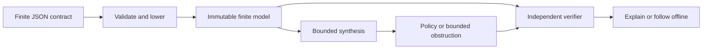

# Contingram

<p align="center">
  
</p>

**Can an agent safely finish after a tool's response is lost?** Contingram compiles a finite tool contract into an observation-based recovery policy—or a checkable proof that no policy works within your decision bound.

A timeout does not reveal whether an effect happened. Retrying can duplicate it; a stale status read can make that retry look safe. Contingram lets connector and SDK maintainers compare recovery interfaces before implementing a controller. It runs offline, requires no model API key, and never invokes tools.

Created and maintained by [Nima Khaki](https://github.com/Nima0101).

## Five-minute quickstart

Requires Rust 1.85 or newer and Git. Dependencies must be available on the first build. Run these commands from a shell:

```sh
git clone https://github.com/Nima0101/contingram.git
cd contingram
cargo build --release --locked
cargo run --release --locked -- demo
cargo run --release --locked -- analyze examples/contracts/receipt.json --horizon 2 > policy.json
cargo run --release --locked -- verify examples/contracts/receipt.json policy.json
cargo run --release --locked -- follow examples/contracts/receipt.json policy.json
cargo run --release --locked -- follow examples/contracts/receipt.json policy.json absent-final
cargo run --release --locked -- follow examples/contracts/receipt.json policy.json absent-final ack
```

The policy first selects `status`. A `committed` observation ends at the goal; `absent-final` permits `send`, then `ack` ends at the goal. Every possible observation branch is checked, including effects hidden from the controller.

Run the full test suite as an additional verification step. The first test build adds compilation time:

```sh
cargo test --locked
```

Explore the failure and resource boundary separately. These commands intentionally return nonzero exit codes:

```sh
cargo run --release --locked -- analyze examples/contracts/stale-read.json --horizon 2
# Exit 1: no_policy_within_horizon, with a portable negative certificate.
cargo run --release --locked -- analyze examples/contracts/receipt.json --max-work 0
# Exit 3: unknown, with a limit reason and no certificate.
cargo run --release --locked -- verify examples/contracts/stale-read.json policy.json
# Exit 2: model_mismatch; an artifact cannot be reused for a changed interface.
```

Shell redirection can truncate an existing destination before a command starts. Check exit codes and verify a fresh report before consuming it. `policy.json` is only a local output, not a required project file. [Authoring guide](docs/authoring.md) covers contract changes, malformed/forged artifacts and manual policies.

## What is established

Within the supplied finite model and horizon, a checked positive policy keeps **every possible world safe and reaches a known goal**. Its decisions depend only on observations. A checked negative artifact rules out **every policy within that horizon**. Compute exhaustion is `unknown`, never a proof of impossibility.

All calls—including sensing, waiting and cancellation—consume decisions. There is no implicit fairness, probability, clock or environment progress. Pending effects must be modeled explicitly. The contract can be wrong about a real service; verification cannot repair an incomplete abstraction. Hashes bind semantics, not truth or authorship. Policies are not execution authorization, and synthesis does not claim optimality.



The verifier reconstructs beliefs and checks both proof polarities without calling the solver. Parsing and lowering remain shared trust boundaries; independent truth tables and a concrete execution oracle test them. See [architecture](docs/architecture.md), [format and limits](docs/protocol-or-format.md), and [evaluation](docs/evaluation.md).

## CLI and library

| Command | Purpose |
| --- | --- |
| `analyze FILE --horizon N` | Produce a checked policy, bounded obstruction, or UNKNOWN |
| `verify MODEL REPORT` | Independently check portable evidence |
| `lower FILE` | Inspect normalized worlds, edges and source origins |
| `explain MODEL REPORT` | Print checked policy/refutation nodes |
| `follow MODEL REPORT [OBSERVATION ...]` | Return the next action or goal, without executing it |
| `demo` | Run the embedded final/stale receipt comparison |
| `telemetry status` / `telemetry explain` | Inspect tracking controls and disclosure |

Exit codes: **0** success/policy, **1** bounded no-policy, **2** invalid input/I/O/check failure, **3** UNKNOWN. Unknown options and duplicate options fail. Default horizon is 8; search defaults are 10,000 nodes and 1,000,000 work units. Hard limits and stable errors are documented in the format guide.

```rust
use contingram::{analyze, compile, parse_contract, verify, CheckLimits, SearchLimits, Status};
fn main() -> Result<(), Box<dyn std::error::Error>> {
let bytes = std::fs::read("examples/contracts/receipt.json")?;
let contract = parse_contract(&bytes)?;
let model = compile(&contract)?;
let report = analyze(&model, SearchLimits { horizon: 2, ..Default::default() })?;
if report.status != Status::Unknown {
    verify(&model, &report, CheckLimits::default())?;
}
Ok(())
}
```

Run this library example with the repository root as the working directory.

The crate is distributed as source and a release package; no crates.io publication is required. Use a local path dependency or a pinned Git revision. See [contributing](CONTRIBUTING.md) for checks, fuzzing and package-consumer validation.

## Telemetry and privacy

Contingram supports an **opt-in telemetry/tracking interface**, **OFF by default**. **v0.1.0 has no collection endpoint and sends or stores no telemetry, even when opted in.** It cannot yet measure adoption. Future collection requires a disclosed first-party operator, endpoint and retention policy.

The closed event schema permits only version, OS family, architecture, command/feature category, coarse result/error class and duration bucket. It excludes prompts, code, tool payloads, secrets, file contents/paths and user/device/project identifiers. No persistent fingerprinting, advertising IDs or data sale/sharing.

Set `CONTINGRAM_TELEMETRY=0` to disable; `CONTINGRAM_TELEMETRY=1` requests opt-in only; collection remains unavailable in this release. `DO_NOT_TRACK` and `DNT` veto collection. Run `contingram telemetry status` or `contingram telemetry explain`. See [telemetry disclosure](docs/telemetry.md) and [threat model](docs/threat-model.md).

## Evidence, scope and related work

The original synthetic corpus covers late effects, stale observations, identity mismatch/expiry, partial completion, idempotent retry, cancellation and multi-step sensing. Three manual recovery tables and nine separately authored held-out models test interface changes. These are reproducible model-relative experiments, not production accuracy or adoption claims. [Evaluation](docs/evaluation.md) provides commands and limitations.

Contingram builds on classical contingent planning and partial-observation games. General planners and model checkers are serious alternatives; related recovery-interface work includes AFT-Bench, Verified Tool Calls, Failing Tools and Temporal. The contribution is the bounded contract-to-independently-checked artifact workflow. See the [research landscape](docs/research-landscape.md) for sources and precise differences.

The CI matrix targets Linux x86_64, macOS arm64 and Windows x86_64. Platform support and release claims require completed hosted checks; inspect the repository's Actions results and release evidence. The core forbids unsafe Rust; untrusted inputs and computation are bounded. See [security policy](SECURITY.md), [verification](docs/verification.md) and [AI-assisted engineering](docs/ai-assisted-engineering.md).

Licensed under [Apache-2.0](LICENSE). Preserve [NOTICE](NOTICE) as required. [Third-party notices](docs/third-party-licenses.md) retain dependency and Rust library license texts. [Trademark policy](TRADEMARKS.md) governs branding, without adding restrictions to the licensed code. [Roadmap](ROADMAP.md) describes future work.

## Optional control-plane reference

The Git checkout's `platform/` directory contains a separate Java 21/Spring Boot
reference with PostgreSQL intent/audit/outbox transactions, JWT authorization,
Kafka delivery/replay and checked offline recovery recommendations. It never
executes external tools. See `platform/README.md` for the real-container test
command, event contract and operational limits. This companion is not part of
the Rust crate or the existing v0.1.0 release; no deployment or adoption is claimed.
