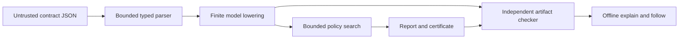

# Architecture

Contingram compiles an explicitly authored, finite tool contract into a recovery
policy or a bounded obstruction. Both complete results carry evidence checked
by a separate traversal. The analysis library functions perform no I/O; the
CLI handles explicit input files and output serialization. The telemetry
status helper reads only its documented preference environment variables.

## Boundaries

| Component | Responsibility |
| --- | --- |
| `contract` | Validate data-only predicates, labels, domains, assignments, and limits. |
| `model` | Enumerate worlds, evaluate simultaneous effects, preserve effect/observation correlation, normalize and hash the model. |
| `solve` | Search over beliefs and remaining horizon; account for work; extract a complete policy or refutation. |
| `certificate` | Represent versioned reports and bounded portable evidence. |
| `verify` | Reconstruct beliefs from the initial model; check every required branch independently of search. |
| `follow` | Recheck a policy and consume an observation prefix to return an action or goal. |
| CLI | Read bounded regular files; expose commands, exit codes, and safe diagnostics. |

A belief is the set of worlds compatible with the observations so far. Actions
are chosen uniformly for that belief. The environment may select any applicable
outcome; it does not cooperate with the controller. Every tool call, including
status or wait, consumes one unit of horizon.

## Independence and its limits

The checker does not invoke the solver or trust its memoized beliefs, counters,
or verdict. It derives observation partitions from the model and checks evidence
under `(node, belief, remaining horizon, polarity)` contexts. A reused node must
work in each context. Backward references and full reachability exclude cycles
and irrelevant appended evidence.

The parser and lowering are shared trust assumptions. Independent certificate
checking cannot detect an incorrect model shared by both algorithms. Separate
lowering-reference tests and a tiny exhaustive oracle address that risk; they
do not prove the Rust implementation or the real tool interface correct.

## Determinism and resources

Canonical ordering fixes states, actions, observations, and edges. Search uses
deterministic work and node limits, not elapsed-time cutoffs. Complete reports
must survive the checker and output-size bound; incomplete work returns
`unknown` without a certificate. There is no claim that the chosen policy
minimizes calls or artifact size.

Telemetry preferences and coarse event types live outside model semantics.
v0.1 has no telemetry endpoint or network transport. See
[telemetry](telemetry.md), [format](protocol-or-format.md), and
[threat model](threat-model.md).

## Separate platform reference

The optional control plane (`platform/README.md` in the Git checkout) wraps the CLI in a Java service
with PostgreSQL intent/audit/outbox transactions and Kafka projections. Its
network, authorization and operational boundaries do not belong to the offline
Rust library. It returns recommendations and does not execute tools.
